# 神经网络 数据标准化

## 概念

### NCHW

实际上代表着[W H C N]

N 代表数量，C 代表通道，H 代表高度，W 代表宽度。


两种方法去处理，一种是 N为数量，C为9种计数率，H和W表示两种诱骗态

一种是 N\*H\*W为数量，(C,H,W)组合为数据

### 特征缩放

将给定数据集的不同特征转化为相近的范围

### Z分数

`z-score` 标准化

均值E，标准差R，则对于每个值x
$$
z=\frac{x-E}{R}
$$
以达到将数据集均值转化为0，标准差转化为1的目的。

这种方法只适用于数据在一个范围内分布的情况。

> 现在遇到的问题是：数据往往都是3位到6位的小数后才有有效位数，可能是导致效果不好的原因。

```python
import torch
import torch.nn.functional as F
a = torch.arange(9, dtype= torch.float)
a = a.reshape((3,3))
print(a)
'''
tensor([[0., 1., 2.],
        [3., 4., 5.],
        [6., 7., 8.]])
'''
# 对二维数组按行归一化
# p=2表示二范式, dim=1表示按行归一化
b = F.normalize(a, p=2, dim=1)
print(b)
'''
tensor([[0.0000, 0.4472, 0.8944],
        [0.4243, 0.5657, 0.7071],
        [0.4915, 0.5735, 0.6554]])
'''
```

使向量除以模长。

### 全局归一化

$$
x=\frac{x-min}{max-min}
$$

### 标准化

$$
z=\frac{x-mean}{std}
$$

std为标准差

### BN层


`nn.BatchNorm2d`和`nn.Dropout`会使用`model.eval()`的数据集


### 激活函数

sigmoid在输入处于[-1,1]之间时，函数值变化敏感，一旦接近或者超出区间就失去敏感性，处于饱和状态，影响神经网络预测的精度值。tanh的输出和输入能够保持非线性单调上升和下降关系，符合BP网络的梯度求解，容错性好，有界，渐进于0、1，符合人脑神经饱和的规律，但比sigmoid函数延迟了饱和期。


## 参数调整

### 基本设置

```
bs = 128 # batch size
lr = 0.00001  # 学习率
epochs = 200 # 迭代次数
```

**网络结构** 基本网络，72输入，5输出，三个全连接层，各自接tanh激活函数层。

激活函数 tanh 非饱和区也主要在(-1,1)但比sigmod稍宽。

损失函数 mse，使用交叉熵不知道为什么总是为负

**数据预处理** 数据大小，每次训练130680组数据，（测试）迭代200次，每次训练加载5个data文件

标准化方法 数据中的每一项输入参数，都计算130680个参数的均值和标准差，通过每个数据-均值，再除以标准差，使数据满足标准差为0，方差为1。

> 但数据没有归一化到(-1,1)的范围

如果使用全局归一化（max和min），新加入的测试数据已经不满足该归一化使用的参数。

### 直接运行

运行结果bias_2

**不对数据进行预处理** 

train_data范围是 `-4.5900e-07~0.0133`

label_data范围是 `-1.5~1.5`

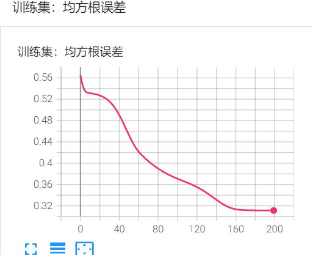

可能还没有收敛

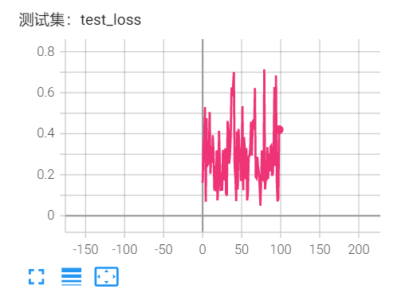


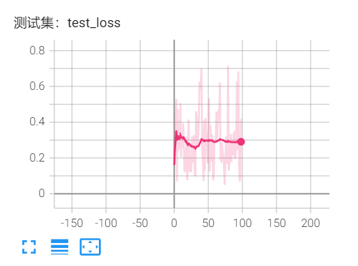

误差大约在0.3左右

按以上运行10次

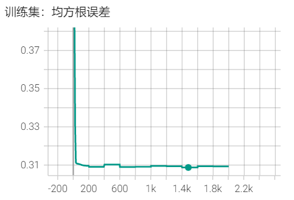

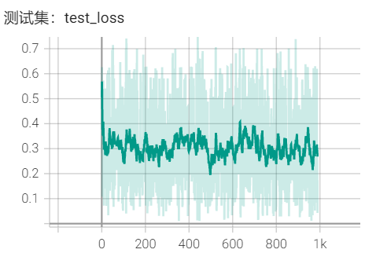


### 归一化处理

使数据满足标准差为0，方差为1。

最后一层不用激活函数

测试是实际数据误差

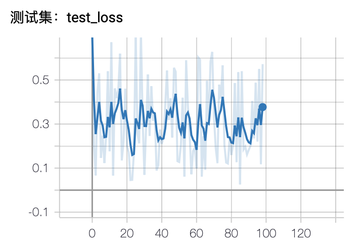

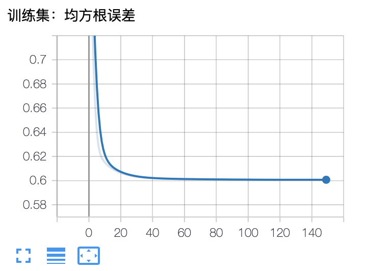

### 加入BN层

运行结果bias_2_BN

为了达到数据归一化到(-1,1)的效果，在第一层的tanh前加入了BN层


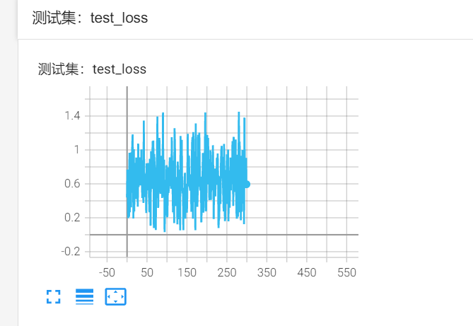

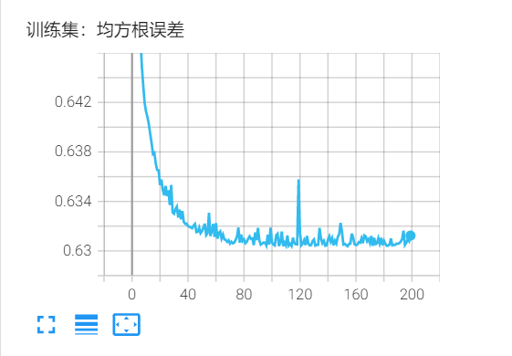

误差会一直维持在0.6以上的状态

### 加入全局归一化

使数据维持在(0,1)之间

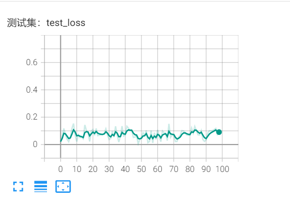

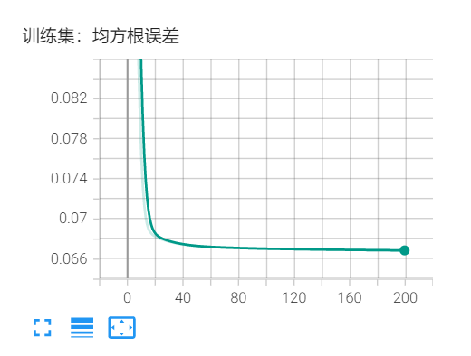

修改学习率误差也都趋于0.066

激活函数改为sigmoid也差不多0.066，，，

### 训练更多数据

以上每次训练5个mat文件的数据，迭代200次或300次，只训练一次。

在每一轮迭代时，必须将5个mat文件数据全部读入到内存。


以下训练5次，一共用到25个mat文件的数据。

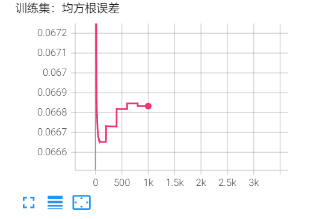


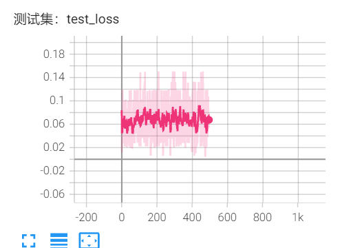


tensor([[0.1571, 0.4712, 0.9000, 0.0000, 0.1571]])
tensor([[-0.6261, -0.0043, -0.6511, -0.0020,  0.0045]])
tensor([[-0.7854, -0.1571, -0.6000,  1.5000, -0.4712]])
tensor([[-0.1716, -0.0035,  0.2009, -0.0019,  0.0019]])
tensor([[-0.1571, -0.4712,  0.3000, -1.2000, -0.7854]])
tensor([[ 0.4901, -0.0013,  0.1906,  0.0009, -0.0012]])
tensor([[ 0.4712, -0.4712,  0.3000, -1.2000,  0.1571]])
tensor([[-0.4033, -0.0035, -0.6504, -0.0012,  0.0037]])
tensor([[-0.4712,  0.4712, -0.6000, -0.6000,  0.4712]])
tensor([[ 0.1294, -0.0013, -0.8996,  0.0014,  0.0017]])
tensor([[ 0.1571,  0.1571, -0.9000,  0.6000, -0.4712]])


## PM

4*9输入：Q_same_Z,Q_same_X,Q_diff_Z,Q_diff_X 诱骗态

3输出：k_A, k_B, PM_bias

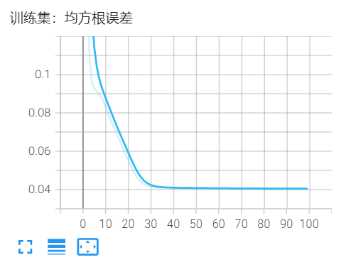

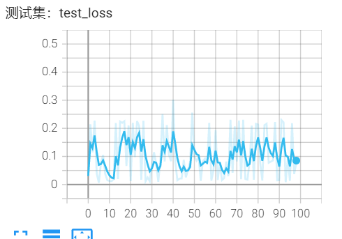

tensor([[ 0.9843, -0.4189,  0.0161]])
tensor([[ 0.9000, -0.3000, -0.7854]])

tensor([[ 0.9326,  0.9601, -0.0146]])
tensor([[ 0.9000,  0.9000, -0.1571]])

tensor([[-1.2446, -1.6701, -0.0244]])
tensor([[-1.2000, -1.5000,  0.4712]])

tensor([[-1.0955, -0.9494,  0.0047]])
tensor([[-1.2000, -0.9000, -0.1571]])

tensor([[4.4607e-01, 4.3073e-01, 2.4823e-04]])
tensor([[ 0.3000,  0.3000, -0.7854]])

tensor([[0.6617, 1.2068, 0.0079]])
tensor([[0.6000, 1.5000, 0.1571]])

tensor([[ 0.8620, -0.2404, -0.0038]])
tensor([[ 0.9000, -0.3000,  0.4712]])


tensor([[ 1.0921,  1.0715, -0.0146]])
tensor([[1.2000, 1.2000, 0.1571]])

tensor([[-0.4040, -0.4829, -0.0014]])
tensor([[-0.3000, -0.6000, -0.7854]])

tensor([[-0.4841, -0.4687,  0.0085]])
tensor([[-1.2000,  0.3000,  0.1571]])

tensor([[-0.1726, -0.1549, -0.0047]])
tensor([[ 1.2000, -1.5000,  0.7854]])

tensor([[0.2294, 0.2334, 0.0006]])
tensor([[ 0.3000,  0.0000, -0.1571]])

tensor([[-0.6402, -0.5079, -0.0007]])
tensor([[-0.9000,  0.0000, -0.1571]])


