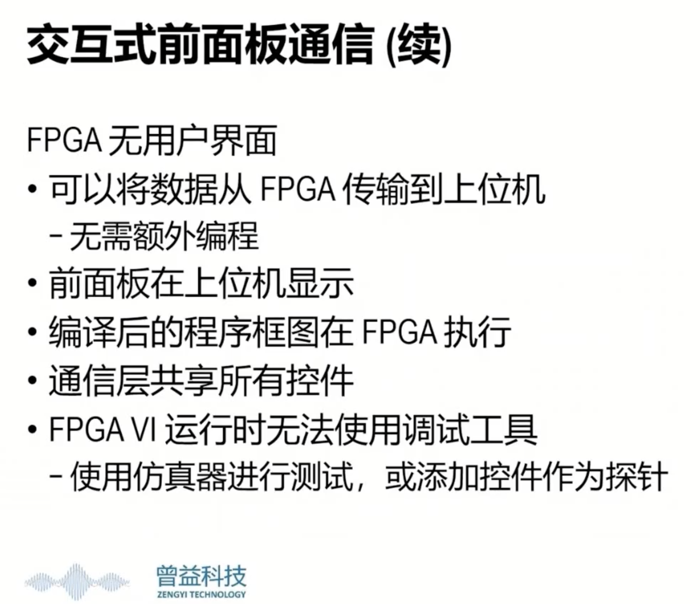
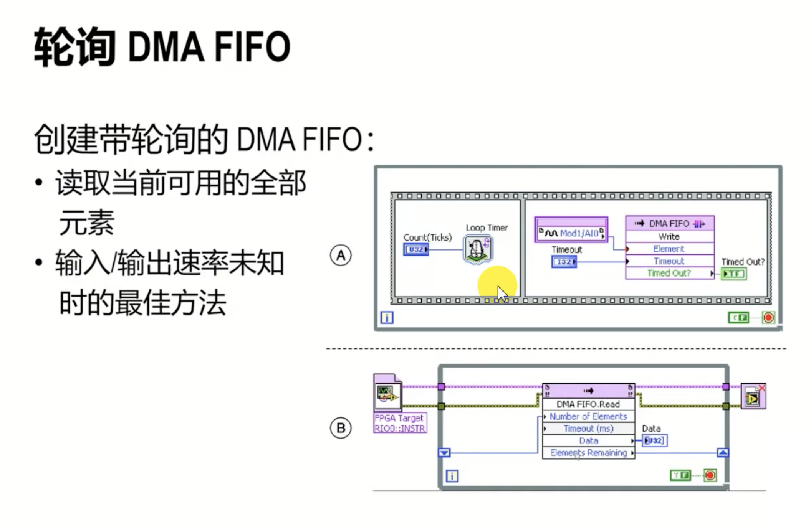

> 实验中用的是R系列数据采集卡(DAQ)

### Tips

- 先下载一个 VI Package Manager，有很多示例的VI程序
- 来源：bilibili视频[https://www.bilibili.com/video/BV13f4y1y7P7?spm_id_from=333.1007.top_right_bar_window_custom_collection.content.click](https://www.bilibili.com/video/BV13f4y1y7P7?spm_id_from=333.1007.top_right_bar_window_custom_collection.content.click)

### LabVIEW FPGA模块组成

- FPGA终端
  - FPGA VI，在FPGA上运行的VI。
  - I/O，指FPGA系统的模拟和数字输入输出
  - 40MHz Onboard Clock，时钟通过指定FPGA系统的定时需求，控制FPGA VI的执行频率
- 主控VI，与FPGA融信，控制数据传输
- 程序生成规范，指定编译FPGA时，LabVIEW创建哪个选项（仿真导出、编译、源代码发布）

> 在b站刷到一个FPGA教程截图

### 创建一个新的FPGA终端项目

- 新建项目，添加FPGA终端
- 创建FPGA VI
- 添加FPGA I/O~~（但并没有）~~
- 添加FPGA时钟、寄存器、存储器、FIFOs
- 必须先编译FPGA VI才能将其下载至FPGA终端并运行
- 得到比特文件后创建上位机接口

### NI PCIe设备

- AIx AOx，模拟输入和模拟输出
- Connectorx/DIOy，连接器x上的数字输入或输出通道y，可以用FPGA I/O节点或者FPGA I/O方法节点
- Connectorx/DIOPORTy，连接器x上的数字输入或输出端口y，一个端口由8路数字通道构成。同上。
- RTSI/RTSIx，触发通道
- 板IO/设备温度

## 编写FPGA VI

> 只支持整型和定点运算，不支持浮点运算

- 上位机通过调用FPGA VI的前面板的控件的值来实现通信

### 编写FPGA I/O

- FPGA I/O的值都是以二进制表示的
- 需要进行二进制的转换，定点数与布尔数组的使用

### 定时

- 循环计时器

- 等待
- 时间计数（通过寄存器保存循环的运行时间）

### 共享资源FIFO

- **另一任务必须等待共享资源使用结束**

- FIFO，长度固定的一个队列
  - 在FPGA终端新建，需设置类型
  - 《实现》中的选项
    - 触发器 <100字节时
    - 查找表 <300字节时
    - 块存储器

- 定义FIFO
- 第一步记得清除或重置
- 添加FIFO方法，并与FIFO关联
- 元素：写入/读取的数据
- 超时：已满情况下的等待时间
- 超时？：已满就返回True

## 与FPGA VI通信

- 函数：打开FPGA引用

- 函数：调用方法

- 函数：关闭FPGA VI

## 数据传输

### 同步

异步：**仅需当前值的控制类应用**

同步：**当上位机运行时FPGA必须停止**，无损的数据传输

### DMA FIFO类型

